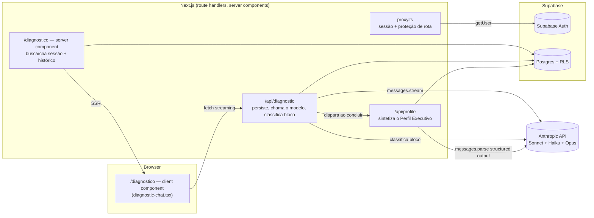
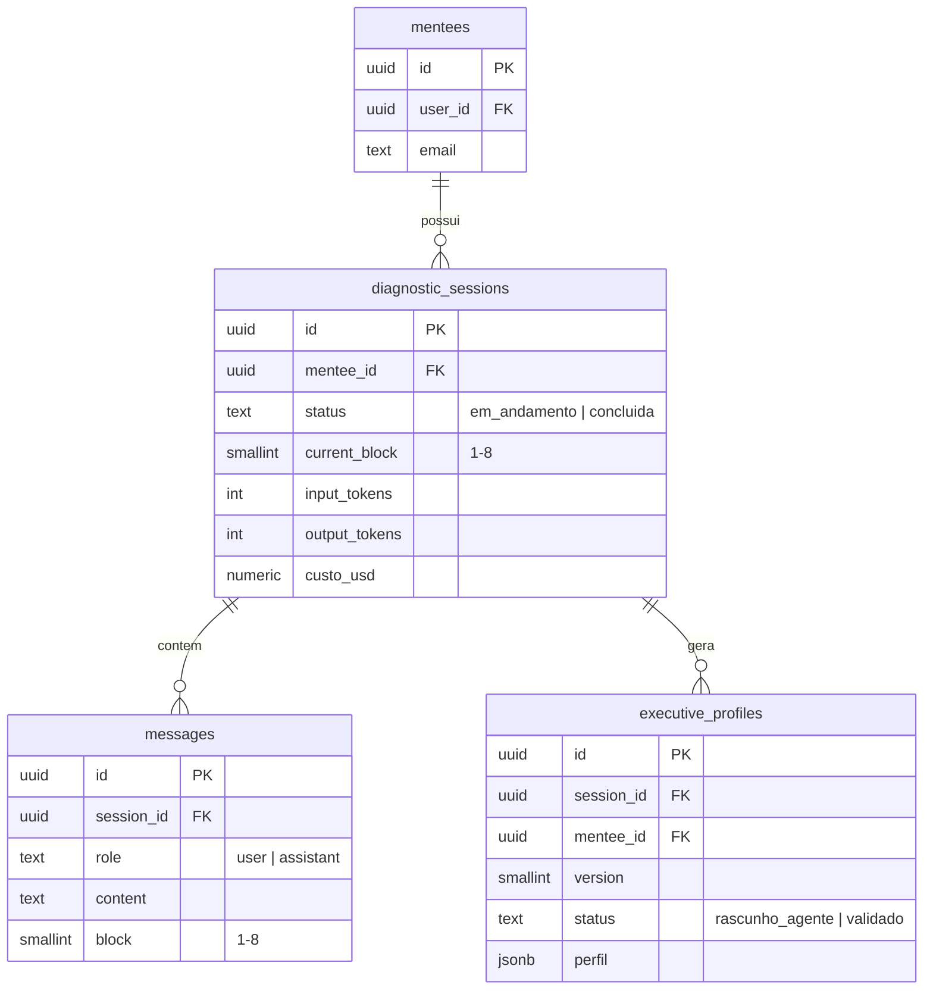
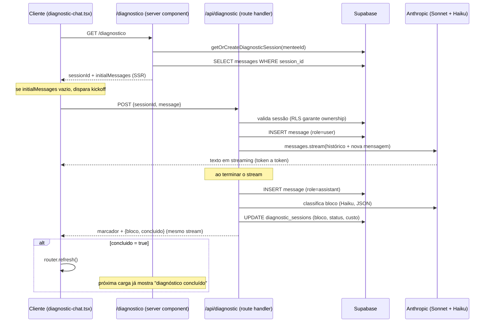

# Arquitetura — T-Shaped Executive

Documentação técnica de como o sistema **está construído**, mantida junto do
código. Complementa `CLAUDE.md` (regras de trabalho), `SPEC-SOFTWARE.md`
(arquitetura-alvo completa) e `SPEC-AGENTS.md` (comportamento dos agentes) —
esses três descrevem a intenção; este documento descreve o estado real.

Atualizado a cada entrega. Se este documento e o código divergirem, o código
está certo e este documento está desatualizado — corrija-o.

---

## 1. Visão geral

Estamos na **Fase 0** (ver `CLAUDE.md`): autenticação, o Diagnostic Agent
conduzindo o Executive Diagnostic, síntese do Perfil Executivo e validação
pelo mentor. Nenhum copiloto, orquestrador, RAG ou Mentor Console — isso é
Fase 1+.

| Entrega | Status |
|---|---|
| 1. Auth por magic link | ✅ feita |
| 2. `/diagnostico` — conversa em 8 blocos com streaming | ✅ feita |
| 3. Persistência de mensagens e controle de bloco | ✅ feita |
| 4. Síntese do Perfil Executivo em JSON | ✅ feita |
| 5. `/mentor` — leitura e validação do perfil | ⬜ próxima |

---

## 2. Stack

- **Next.js 16 (App Router) + TypeScript** — Turbopack, `proxy.ts` (Next 16
  renomeou `middleware.ts` → `proxy.ts`; ver §6)
- **Tailwind v4 + shadcn/ui** — componentes configurados manualmente
  (`ui.shadcn.com` não está acessível no ambiente onde este projeto foi
  desenvolvido; o código gerado é idêntico ao que o CLI produziria)
- **Supabase** — Postgres + Auth (magic link), RLS em todas as tabelas
- **Anthropic API** (`@anthropic-ai/sdk`) — Sonnet na conversa, Haiku na
  classificação de bloco, Opus na síntese do Perfil Executivo
- **Zod** (`v4`) — validação de saída estruturada da Anthropic API
  (`messages.parse` + `zodOutputFormat`), único jeito confiável de garantir
  "exatamente três gaps" e o resto do schema sem depender de o modelo
  obedecer instrução em texto livre. Único acréscimo à stack declarada no
  `CLAUDE.md` até agora — registrado aqui por transparência, não é silencioso
- **Deploy**: Vercel (ainda não configurado)

Sem bibliotecas fora dessa lista. Ver `CLAUDE.md` antes de adicionar algo.

---

## 3. Arquitetura de alto nível

Regra de segurança que molda tudo isso: **toda chamada ao modelo passa por
route handler no servidor** (`ANTHROPIC_API_KEY` nunca chega ao browser). O
cliente só fala com `/api/diagnostic`; nunca com a Anthropic diretamente.

---

## 4. Modelo de dados (Fase 0)

Quatro tabelas, RLS ativo em todas — o mentorado só enxerga as próprias
linhas (`mentee_id` → `mentees.user_id = auth.uid()`).

Migrations em `supabase/migrations/`:
- `0001_init.sql` — as 4 tabelas + RLS
- `0002_diagnostic_tracking.sql` — colunas de custo em `diagnostic_sessions`
  (tokens e USD por sessão; ainda não é a tabela `agent_runs` genérica da
  Fase 1, que cobre todos os agentes e turmas)
- `0003_executive_profiles_insert.sql` — policy de INSERT em
  `executive_profiles` restrita a `status = 'rascunho_agente'` (ver §5.4)

O mentor (Entrega 5) vai precisar ler dados de mentorados que não são ele —
RLS não permite isso por padrão. A decisão registrada é: acesso do mentor
via `service_role` key no servidor, atrás de uma allowlist de e-mail
(`MENTOR_EMAILS`), sem tabela de papéis — ver `CLAUDE.md` §"Como trabalhar
comigo" e a conversa que definiu esse escopo mínimo.

---

## 5. Fluxos principais

### 5.1 Autenticação (Entrega 1)

1. `/login` (client) chama `supabase.auth.signInWithOtp` direto do browser
   — não precisa de route handler porque é uma chamada ao Supabase, não ao
   modelo.
2. `/auth/callback` (route handler) troca o código pela sessão e roda
   `ensureMentee` — cria a linha em `mentees` no primeiro acesso.
3. `proxy.ts` roda em toda request: atualiza a sessão via cookies e decide
   redirecionar. Rotas `/api/*` **não** são redirecionadas quando não
   autenticadas — respondem 401 direto, porque um redirect (307) quebraria
   um `fetch()` de streaming em andamento (o browser seguiria o redirect e
   trataria o HTML de `/login` como resposta do modelo). Ver commit da
   Entrega 2 — foi um bug real, não uma decisão de design a priori.

### 5.2 Conversa do diagnóstico (Entregas 2 e 3)

Duas decisões que vale registrar o porquê:

- **Quem controla o bloco.** O prompt do Diagnostic Agent (`SPEC-AGENTS.md`
  §5) já instrui o modelo a conduzir os 8 blocos um de cada vez — ele não
  precisa receber "você está no bloco 3" a cada turno. O que o servidor
  precisa é *saber* em que bloco a conversa está, pra persistir, retomar
  sessão e (nas próximas entregas) liberar a síntese do perfil. Por isso um
  classificador leve em Haiku roda depois de cada resposta do agente,
  lendo só o texto gerado — mesmo padrão do Roteador descrito no
  `SPEC-AGENTS.md`, aplicado aqui num escopo menor.
- **Protocolo cliente-servidor.** O texto da resposta e os metadados de
  bloco (`{bloco, concluido}`) viajam no mesmo stream de texto, separados
  por um marcador (`DIAGNOSTIC_META_MARKER`). Evita uma segunda rodada de
  rede só para descobrir o bloco, à custa de um protocolo caseiro — aceitável
  porque cliente e servidor são o mesmo código, não uma API pública.

### 5.3 Síntese do Perfil Executivo (Entrega 4)

Disparada automaticamente pelo próprio `/api/diagnostic`, dentro de
`finalizeTurn`, no exato turno em que o classificador de bloco marca
`concluido = true` — não depende do cliente lembrar de chamar nada. A rota
`POST /api/profile` também existe e chama a mesma função
(`synthesizeExecutiveProfile`), para permitir gerar de novo mais adiante
(ex.: ação do mentor na Fase 1); hoje nada mais a chama.

1. Carrega a transcrição completa da sessão (`messages`, em ordem)
2. Chama Opus com `messages.parse` + `zodOutputFormat` — saída estruturada
   imposta pela API, não por instrução de texto. O schema Zod
   (`executive-profile-schema.ts`) espelha o JSON do `SPEC-AGENTS.md` §5,
   incluindo `gaps` com `.length(3)` — "exatamente três gaps" é imposto
   pela própria chamada, não checado depois
3. Falha de parse → até 2 novas tentativas (`SPEC-SOFTWARE.md` §11, regra
   geral de geração de artefato, aplicada aqui ao perfil)
4. Persiste em `executive_profiles` com a próxima versão da sessão,
   `status = 'rascunho_agente'` (default da coluna — nunca setado
   explicitamente para outra coisa nesta rota)
5. Acumula custo (Opus) em `diagnostic_sessions`, junto do que a conversa e
   a classificação já registraram

**Por que não precisou de `service_role` ainda.** O insert roda com o
client Supabase autenticado como o próprio mentorado (cookies da sessão),
não com a service role — mas ele nunca escreve nada arbitrário: o conteúdo
vem inteiro do Opus, nunca de input do cliente. O único risco real é
alguém chamar a REST API do Supabase direto (fora da nossa rota) tentando
se autovalidar; a migration `0003` fecha isso travando o INSERT em
`status = 'rascunho_agente'` via RLS. `service_role` só entra na Entrega 5,
quando o mentor precisar ler e validar perfis de mentorados que não são
ele — isso RLS não resolve de jeito nenhum, porque não é sobre a própria
linha.

O prompt de síntese (`profile-prompt.ts`) **não é verbatim** da spec como o
do Diagnostic Agent — o `SPEC-AGENTS.md` dá o schema e um punhado de regras
soltas ("gaps sempre 3", "sinais_para_o_mentor nunca é exibido ao
mentorado", o enquadramento da devolutiva), mas não um prompt narrativo
completo para este passo. Transcrevi as regras dadas e escrevi o texto de
conexão em torno delas — vale revisão sua.

### 5.4 Prompt do agente

`src/lib/agents/diagnostic-prompt.ts` concatena o prompt base (comum a
todos os agentes) com o prompt específico do Diagnostic Agent — ambos
transcritos **verbatim** do `SPEC-AGENTS.md` §3 e §5. Esse módulo nunca é
importado por um client component (haveria vazamento do prompt no bundle do
browser); a mensagem de kickoff e o marcador de metadados, que são
inofensivos, ficam separados em `diagnostic-kickoff.ts` justamente para
serem seguros de importar do lado do cliente.

---

## 6. Decisões técnicas registradas

| Decisão | Por quê |
|---|---|
| Rota chama-se `/api/diagnostic`, não `/api/chat` | `SPEC-SOFTWARE.md` reserva `/api/chat` para o copiloto com roteamento entre agentes (Fase 1+). Usar o mesmo nome agora colidiria depois. |
| `proxy.ts` (não `middleware.ts`) | Convenção nova do Next.js 16 — o antigo nome está deprecated nesta versão. |
| `/api/*` responde 401 em vez de redirecionar | Redirect quebraria `fetch()` de streaming se a sessão expirar no meio de uma chamada. |
| Controle de bloco via classificador Haiku separado, não via o próprio Diagnostic Agent | O prompt do agente (fonte de verdade) não deveria ser alterado para emitir metadados estruturados só por conveniência de engenharia — mais barato e mais seguro rodar uma leitura auxiliar depois. |
| shadcn/ui configurado manualmente | `ui.shadcn.com` (usado pelo CLI oficial) não está acessível no ambiente de desenvolvimento; o resultado é equivalente. |
| Sem `agent_runs` genérica ainda | Essa tabela (Fase 1) cobre todos os agentes e cohorts; para a Fase 0, bastam colunas de custo direto em `diagnostic_sessions`. |
| Acesso do mentor via `service_role` + allowlist de e-mail, sem tabela de papel | Decisão explícita para não antecipar "papéis, permissões granulares", que o `CLAUDE.md` exclui da Fase 0. |
| Saída do perfil via `messages.parse` + `zodOutputFormat` (Zod), não texto livre + `JSON.parse` | "Exatamente três gaps" e o resto do schema são regra dura da spec — melhor a API impor a forma na geração do que validar depois e torcer. Único ponto do projeto que usa uma lib de validação; adicionada por isso, não por hábito. |
| Síntese do perfil dispara de dentro de `/api/diagnostic`, não só pela rota `/api/profile` | Sem fila/job em background na Fase 0 — se o gatilho fosse só o cliente chamar `/api/profile` depois do `router.refresh()`, uma aba fechada no momento certo deixaria o perfil sem ser gerado. O servidor garante que roda uma vez, no mesmo request que fecha a sessão. |
| Insert em `executive_profiles` sem `service_role`, com policy travando `status = 'rascunho_agente'` | O conteúdo do perfil nunca vem de input do cliente (sempre do Opus); o único risco é auto-validação via REST direta, que a policy já impede. `service_role` fica reservado para quando for genuinamente necessário — leitura cross-mentorado do mentor, na Entrega 5. |

---

## 7. Convenções de código

- Código e nomes de arquivo em inglês; conteúdo visível ao mentorado em
  português (`CLAUDE.md`).
- Server component por padrão; client component (`"use client"`) só quando
  há interação (formulário, streaming, estado local).
- Um módulo, uma responsabilidade: prompt do agente, sessão, classificador
  de bloco e precificação são arquivos separados em `src/lib/agents/` e
  `src/lib/`.
- Nenhum segredo (`ANTHROPIC_API_KEY`, `SUPABASE_SERVICE_ROLE_KEY`) sai do
  servidor nem entra em `NEXT_PUBLIC_*`.

---

## 8. Próximos passos

1. **Entrega 5 — `/mentor`**: leitura dos perfis pendentes e ação de
   validação (`rascunho_agente` → `validado`), atrás da allowlist de
   e-mail via `service_role`. Precisa de `SUPABASE_SERVICE_ROLE_KEY`
   configurada de verdade para testar ponta a ponta.
2. **Em aberto, fora da ordem das entregas**: revisão da organização dos
   agentes — hoje cada peça (prompt, classificador, precificação, síntese
   de perfil) é um módulo TypeScript comum sob `src/lib/agents/`; está em
   avaliação migrar as execuções que fizerem sentido para o formato de
   Skills, para alinhar com a prática recomendada de organização de
   agentes.
3. **Validação ponta a ponta pendente**: nenhuma das Entregas 1-4 rodou
   ainda contra um Supabase e uma `ANTHROPIC_API_KEY` reais — só contra
   placeholders, para validar build/tipos. Falta confirmar login real,
   streaming real, e a síntese do perfil rodando contra a API de verdade.
