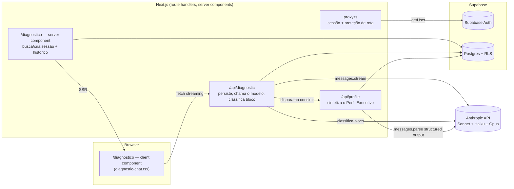
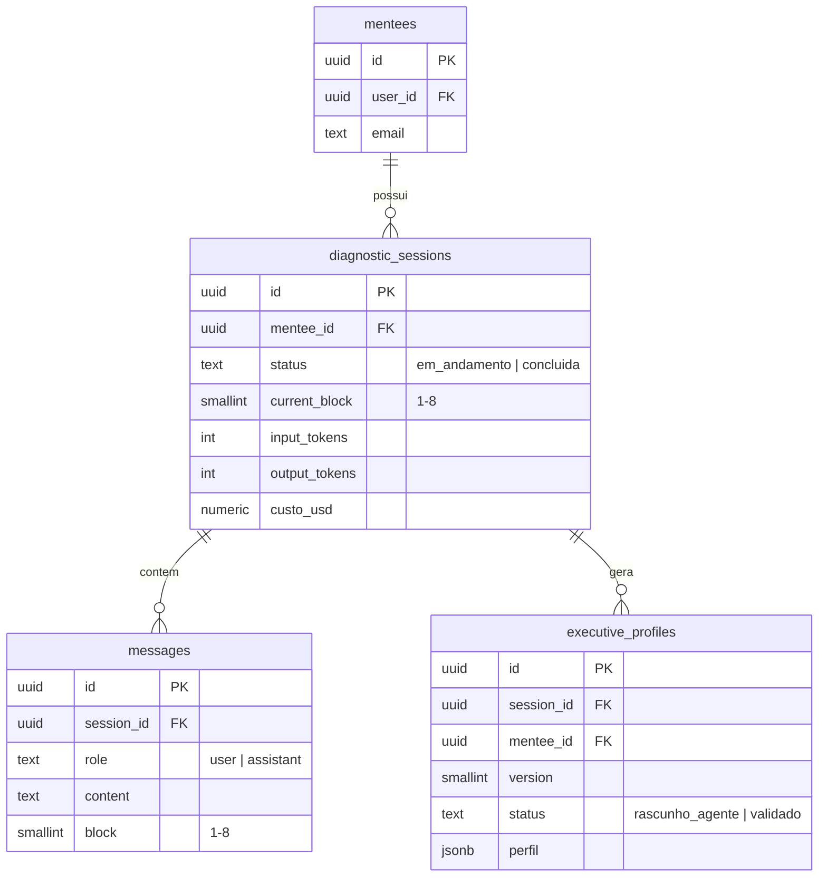
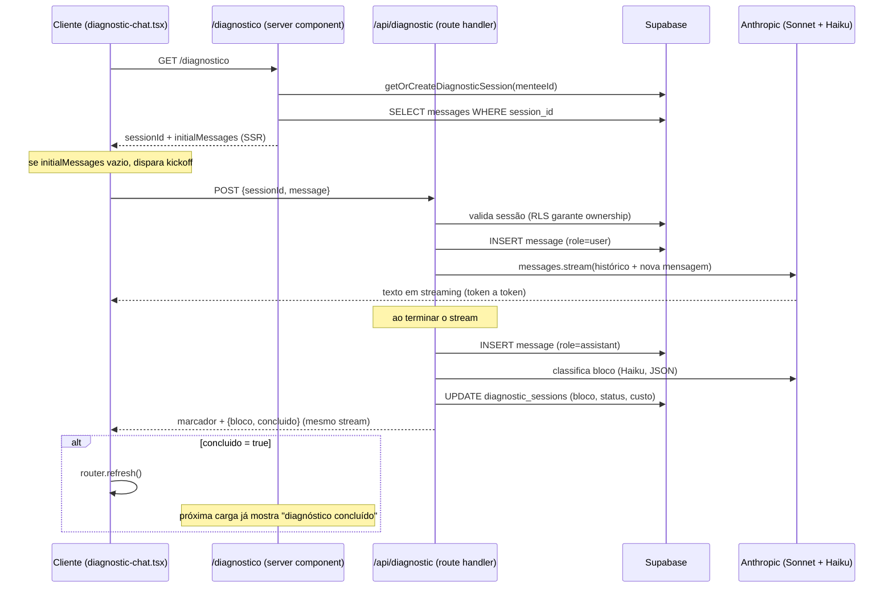

# Arquitetura — T-Shaped Executive

Documentação técnica de como o sistema **está construído**, mantida junto do
código. Complementa `CLAUDE.md` (regras de trabalho), `SPEC-SOFTWARE.md`
(arquitetura-alvo completa) e `SPEC-AGENTS.md` (comportamento dos agentes) —
esses três descrevem a intenção; este documento descreve o estado real.

Atualizado a cada entrega. Se este documento e o código divergirem, o código
está certo e este documento está desatualizado — corrija-o.

---

## 1. Visão geral

**Fase 0** (ver `CLAUDE.md`) está completa e validada: autenticação, o
Diagnostic Agent conduzindo o Executive Diagnostic, síntese do Perfil
Executivo e validação pelo mentor.

**As 5 entregas da Fase 0 estão feitas em código e validadas de ponta a
ponta contra Supabase e Anthropic reais** (login → 8 blocos do
diagnóstico → síntese do perfil → validação do mentor). Essa validação
encontrou e corrigiu um bug real — ver §6.

| Entrega | Status |
|---|---|
| 1. Auth por magic link | ✅ feita e validada ao vivo |
| 2. `/diagnostico` — conversa em 8 blocos com streaming | ✅ feita e validada ao vivo |
| 3. Persistência de mensagens e controle de bloco | ✅ feita e validada ao vivo |
| 4. Síntese do Perfil Executivo em JSON | ✅ feita e validada ao vivo |
| 5. `/mentor` — leitura e validação do perfil | ✅ feita e validada ao vivo |

**Fase 1** (`SPEC-SOFTWARE.md` §15: corpus ingerido → orquestrador → Career
Copilot → artefatos de FIND → `/jornada`) está **completa e validada de
ponta a ponta** contra Supabase e Anthropic reais — mesmo rigor da Fase 0.

| Entrega (ordem da spec) | Status |
|---|---|
| Schema Fase 1 completo (`0004_fase1_schema.sql`, `0005_knowledge_search.sql`) | ✅ feita e rodada em produção |
| Corpus ingerido — 10 playbooks reais, `scripts/ingest-playbooks.js` | ✅ feito e validado ao vivo — 21 chunks, busca por similaridade testada e retornando resultado relevante |
| Orquestrador (roteador + gate de etapa liberada) + Career Copilot (`/api/chat`) | ✅ feita e validada ao vivo |
| Geração de artefato (`POST /api/artifact`) + validação pelo mentor | ✅ feita e validada ao vivo |
| `/copiloto`, `/jornada`, fila de validação em `/mentor` e `/mentor/[menteeId]` | ✅ feitas e validadas ao vivo |

Fluxo completo rodado de verdade: mentorado conversa com o Career Copilot
(usando perfil real + RAG do corpus real) → gera os 3 artefatos de FIND →
mentor vê a fila, valida os 3 → `/jornada` mostra tudo validado. Essa
validação encontrou e corrigiu **dois bugs reais**, nenhum pego por
`tsc`/`lint`/`build`:

1. **Campos enum na geração de artefato.** `nivel_atual`, `nivel_exigido`
   (`competency_map`), `situacao`, `distancia` (`next_chair_map`) são
   `z.enum(...)` sem `.nullable()`. O prompt de geração diz "campo sem
   base fica vazio" — para string/lista isso é `""`/`[]`, mas um enum de
   opções fixas não tem como representar "vazio" (a API do Opus tenta
   emitir algo fora da lista, o Zod rejeita, esgota as 3 tentativas,
   `502`). `competency_map` e `next_chair_map` falharam 100% das vezes;
   `career_map` (sem nenhum campo enum) passou de primeira — o padrão do
   erro apontou direto pra causa. Corrigido: os 4 campos viraram
   `.nullable()`, o prompt agora distingue explicitamente "campo de texto/
   lista vazio" de "campo de opção fixa sem base = `null`", e a UI
   (`artifact-detail.tsx`) trata `null` como "Ainda não avaliado".
2. **Query ambígua em `/mentor`.** `artifacts` tem duas FKs pra `mentees`
   (`mentee_id` e `validado_por`) — `.select(..., mentees(email))` sem
   desambiguar dá `PGRST201` (300 Multiple Choices) do PostgREST, porque
   ele não sabe qual relação usar. A página inteira quebrava (erro 500)
   assim que existia qualquer artefato pendente. Corrigido com o hint
   explícito `mentees!artifacts_mentee_id_fkey(email)`.

`tsc`, `lint` e `build` passam limpos depois das correções.

**Fase 2** (`SPEC-SOFTWARE.md` §15: Business e Value Copilot, `/biblioteca`)
começou. Primeira entrega — `/api/mentor/advance` e Business Copilot —
está **completa e validada ao vivo**.

| Entrega | Status |
|---|---|
| `POST /api/mentor/advance` | ✅ feita e validada ao vivo |
| Business Copilot (`/api/chat`) + `business_map` | ✅ feita e validada ao vivo |
| Value Copilot + `value_creation_map` | não iniciado |
| Anexos (`POST /api/attachments`) + `/biblioteca` | não iniciado |

Validado ao vivo: mentee de teste conversou com o Career Copilot (regressão
— continua funcionando), mentor avançou a etapa pra UNDERSTAND pela nova
seção "Jornada" em `/mentor/[menteeId]`, mentee conversou com o Business
Copilot (roteador classificou corretamente, contexto financeiro real —
"MDR", "70% da receita" — apareceu no `business_map` gerado), mentor
validou, `/jornada` passou a mostrar só o Business Map (o filtro por
etapa funcionou — os 3 artefatos de FIND somem da tela assim que a etapa
avança, ficam só em `/mentor/[menteeId]`, a visão histórica). Testado
também o caminho de bloqueio: mentee ainda em FIND perguntando algo de
Business recebe a ponte do próprio Career Copilot, sem `service_role`
insuficiente ou etapa incorreta; e `POST /api/artifact` recusa gerar
`business_map` (403) pra quem ainda não tem UNDERSTAND liberado.

Um bug real de menor porte, achado ao generalizar pra 2 copilotos: em
`artifact-generation.ts`, `persistArtifact` gravava `gerado_por: "career"`
fixo, e a transcrição usada na geração pegava mensagens de **todos** os
territórios, não só o do artefato sendo gerado — inofensivo enquanto só
Career existia, silenciosamente errado assim que Business entrou (um
`business_map` puxaria conversa de carreira junto). Corrigido com
`ARTIFACT_AGENT[tipo]` filtrando a query e definindo `gerado_por`.

**LGPD** (`SPEC-SOFTWARE.md` §12) — requisito transversal, não amarrado a
uma fase — foi fechado nesta janela: `/privacidade` (base legal, finalidade,
retenção, canal de exclusão, declaração de não-treinamento), link visível
antes do login (`/login`) e a partir de `/conta`, e exclusão completa
self-service via `POST /api/account/delete`.

| Decisão | Motivo |
|---|---|
| Exclusão self-service no portal, não canal por e-mail processado manualmente | Pedido explícito do usuário — ver decisões de retenção/canal abaixo |
| `POST /api/account/delete` só chama `admin.auth.admin.deleteUser(user.id)`, sem apagar linha por linha | `mentees.user_id` referencia `auth.users` com `on delete cascade` (0001_init.sql), e toda tabela de domínio cascateia a partir de `mentees.id` — apagar o `auth.users` já propaga pra `diagnostic_sessions`, `messages`, `executive_profiles`, `journey_state`, `conversations`, `attachments`, `artifacts`, `mentor_flags`, `mentor_notes`. `agent_runs.mentee_id` é a única exceção (`on delete set null`, de propósito — mantém custo/latência agregado sem vínculo pessoal) |
| Base legal: execução de contrato (dados operacionais) + consentimento explícito (dados sensíveis da conversa) | Decisão de produto, escolhida pelo usuário nas opções apresentadas |
| Retenção: até 30 dias após solicitação | Decisão de produto — na prática a exclusão self-service é imediata, a janela é teto, não meta |

Validado ao vivo contra o Supabase real: criado usuário de teste com linha
em `mentees`, `diagnostic_sessions`, `messages`, `executive_profiles`,
`journey_state`, `conversations`, `artifacts`, `mentor_flags` e
`agent_runs`; chamado `admin.auth.admin.deleteUser` (mesma chamada da
rota); confirmado que todas as 8 primeiras zeraram e `agent_runs`
sobreviveu com `mentee_id = null`, como desenhado. (Na primeira tentativa
a chamada falhou com "Host not in allowlist" — não era bloqueio de rede,
era o `fetch` nativo do Node não respeitar `HTTPS_PROXY` por padrão;
resolvido rodando com `NODE_USE_ENV_PROXY=1`, sem qualquer mudança no
código do produto.) Único caso de borda não coberto: `executive_profiles.validated_by`
referencia `auth.users(id)` sem `on delete cascade` — se a conta sendo
excluída já validou algum perfil como mentor, o `deleteUser` falha por
violação de FK (a rota devolve 500, sem corromper nada). Não bloqueia o
caso de uso (mentorado se autoexcluindo); só afetaria uma autoexclusão de
mentor, fora de escopo aqui.

`tsc`, `lint` e `build` passam limpos.

**Rejeitar perfil/artefato** (`docs/HUMAN-CHECKLIST.md` §2, decisão B) —
mentor agora tem "Validar" e "Rejeitar" lado a lado em `/mentor` e
`/mentor/[menteeId]`, pro perfil e pros 4 artefatos. Rejeitar exige
justificativa (campo obrigatório, trava tanto no client quanto num check
constraint no banco); o mentorado vê o motivo em `/jornada` (artefato) ou
na home (perfil).

| Decisão | Motivo |
|---|---|
| Status novo `rejeitado` nas duas tabelas, em vez de reaproveitar `arquivado` (que já existe em `artifacts`) | `arquivado` não tem semântica de "motivo obrigatório" nem de "aparece pro mentorado com o porquê" — são conceitos diferentes; forçar os dois no mesmo valor deixaria a UI ambígua |
| `ReviewActions` substitui `ValidateButton`, um componente só para as duas ações | Validar e rejeitar são a mesma decisão binária do mentor sobre o mesmo item — mesmo padrão de "uma responsabilidade" já usado em `DeleteAccountButton` (ação + confirmação inline) |
| Artefato rejeitado libera `GenerateArtifactButton` de novo (mesma condição que já existia para `validado_mentor`) | O mentorado pode voltar a conversar com o copiloto e pedir nova versão — `POST /api/artifact` já bloqueia só quando existe `rascunho_agente` pendente, `rejeitado` não conta, nenhuma mudança necessária ali |
| Perfil rejeitado **não** ganhou botão de "gerar nova síntese" | `synthesizeExecutiveProfile` usa a transcrição fixa da sessão de diagnóstico já encerrada — chamar de novo com o mesmo texto tende a produzir o mesmo perfil. Sem uma forma de reabrir o diagnóstico (fora de escopo, não pedido), o caminho de correção é o mentor retomar contato diretamente; a tela só mostra o motivo |

Migration `0006_rejeicao.sql` aplicada pelo usuário no SQL Editor do
Supabase (eu não tinha connection string de Postgres direta pra rodar
sozinho). Validado ao vivo depois: usuário de teste com perfil e artefato
em `rascunho_agente`; confirmado que `update` pra `rejeitado` sem
`motivo_rejeicao` é bloqueado pela constraint em ambas as tabelas;
rejeição com motivo grava `status`, `motivo_rejeicao`, `rejeitado_em`,
`rejeitado_por` corretamente; repetir a rejeição num item já rejeitado é
no-op (a trava `.eq("status", "rascunho_agente")` não encontra a linha,
rota devolveria 404, mesmo padrão de `/api/mentor/validate`); artefato
rejeitado não deixa `rascunho_agente` pendente, então `POST /api/artifact`
não bloquearia gerar nova versão. `tsc`, `lint` e `build` passam limpos.

---

## 2. Stack

- **Next.js 16 (App Router) + TypeScript** — Turbopack, `proxy.ts` (Next 16
  renomeou `middleware.ts` → `proxy.ts`; ver §6)
- **Tailwind v4 + shadcn/ui** — componentes configurados manualmente
  (`ui.shadcn.com` não está acessível no ambiente onde este projeto foi
  desenvolvido; o código gerado é idêntico ao que o CLI produziria)
- **Supabase** — Postgres + Auth (magic link), RLS em todas as tabelas
- **Anthropic API** (`@anthropic-ai/sdk`) — Sonnet na conversa, Haiku na
  classificação de bloco, Opus na síntese do Perfil Executivo
- **Zod** (`v4`) — validação de saída estruturada da Anthropic API
  (`messages.parse` + `zodOutputFormat`), único jeito confiável de garantir
  "exatamente três gaps" e o resto do schema sem depender de o modelo
  obedecer instrução em texto livre. Único acréscimo à stack declarada no
  `CLAUDE.md` até agora — registrado aqui por transparência, não é silencioso
- **Deploy**: Vercel (ainda não configurado)

Sem bibliotecas fora dessa lista. Ver `CLAUDE.md` antes de adicionar algo.

---

## 3. Arquitetura de alto nível



Regra de segurança que molda tudo isso: **toda chamada ao modelo passa por
route handler no servidor** (`ANTHROPIC_API_KEY` nunca chega ao browser). O
cliente só fala com `/api/diagnostic`; nunca com a Anthropic diretamente.

---

## 4. Modelo de dados (Fase 0)

Quatro tabelas, RLS ativo em todas — o mentorado só enxerga as próprias
linhas (`mentee_id` → `mentees.user_id = auth.uid()`).



Migrations em `supabase/migrations/`:
- `0001_init.sql` — as 4 tabelas + RLS
- `0002_diagnostic_tracking.sql` — colunas de custo em `diagnostic_sessions`
  (tokens e USD por sessão; ainda não é a tabela `agent_runs` genérica da
  Fase 1, que cobre todos os agentes e turmas)
- `0003_executive_profiles_insert.sql` — policy de INSERT em
  `executive_profiles` restrita a `status = 'rascunho_agente'` (ver §5.4)

O mentor (Entrega 5) vai precisar ler dados de mentorados que não são ele —
RLS não permite isso por padrão. A decisão registrada é: acesso do mentor
via `service_role` key no servidor, atrás de uma allowlist de e-mail
(`MENTOR_EMAILS`), sem tabela de papéis — ver `CLAUDE.md` §"Como trabalhar
comigo" e a conversa que definiu esse escopo mínimo.

---

## 5. Fluxos principais

### 5.1 Autenticação (Entrega 1)

1. `/login` (client) chama `supabase.auth.signInWithOtp` direto do browser
   — não precisa de route handler porque é uma chamada ao Supabase, não ao
   modelo.
2. `/auth/callback` (route handler) troca o código pela sessão e roda
   `ensureMentee` — cria a linha em `mentees` no primeiro acesso.
3. `proxy.ts` roda em toda request: atualiza a sessão via cookies e decide
   redirecionar. Rotas `/api/*` **não** são redirecionadas quando não
   autenticadas — respondem 401 direto, porque um redirect (307) quebraria
   um `fetch()` de streaming em andamento (o browser seguiria o redirect e
   trataria o HTML de `/login` como resposta do modelo). Ver commit da
   Entrega 2 — foi um bug real, não uma decisão de design a priori.

### 5.2 Conversa do diagnóstico (Entregas 2 e 3)



Duas decisões que vale registrar o porquê:

- **Quem controla o bloco.** O prompt do Diagnostic Agent (`SPEC-AGENTS.md`
  §5) já instrui o modelo a conduzir os 8 blocos um de cada vez — ele não
  precisa receber "você está no bloco 3" a cada turno. O que o servidor
  precisa é *saber* em que bloco a conversa está, pra persistir, retomar
  sessão e (nas próximas entregas) liberar a síntese do perfil. Por isso um
  classificador leve em Haiku roda depois de cada resposta do agente,
  lendo só o texto gerado — mesmo padrão do Roteador descrito no
  `SPEC-AGENTS.md`, aplicado aqui num escopo menor.
- **Protocolo cliente-servidor.** O texto da resposta e os metadados de
  bloco (`{bloco, concluido}`) viajam no mesmo stream de texto, separados
  por um marcador (`DIAGNOSTIC_META_MARKER`). Evita uma segunda rodada de
  rede só para descobrir o bloco, à custa de um protocolo caseiro — aceitável
  porque cliente e servidor são o mesmo código, não uma API pública.

### 5.3 Síntese do Perfil Executivo (Entrega 4)

Disparada automaticamente pelo próprio `/api/diagnostic`, dentro de
`finalizeTurn`, no exato turno em que o classificador de bloco marca
`concluido = true` — não depende do cliente lembrar de chamar nada. A rota
`POST /api/profile` também existe e chama a mesma função
(`synthesizeExecutiveProfile`), para permitir gerar de novo mais adiante
(ex.: ação do mentor na Fase 1); hoje nada mais a chama.

1. Carrega a transcrição completa da sessão (`messages`, em ordem)
2. Chama Opus com `messages.parse` + `zodOutputFormat` — saída estruturada
   imposta pela API, não por instrução de texto. O schema Zod
   (`executive-profile-schema.ts`) espelha o JSON do `SPEC-AGENTS.md` §5,
   incluindo `gaps` com `.length(3)` — "exatamente três gaps" é imposto
   pela própria chamada, não checado depois
3. Falha de parse → até 2 novas tentativas (`SPEC-SOFTWARE.md` §11, regra
   geral de geração de artefato, aplicada aqui ao perfil)
4. Persiste em `executive_profiles` com a próxima versão da sessão,
   `status = 'rascunho_agente'` (default da coluna — nunca setado
   explicitamente para outra coisa nesta rota)
5. Acumula custo (Opus) em `diagnostic_sessions`, junto do que a conversa e
   a classificação já registraram

**Por que não precisou de `service_role` ainda.** O insert roda com o
client Supabase autenticado como o próprio mentorado (cookies da sessão),
não com a service role — mas ele nunca escreve nada arbitrário: o conteúdo
vem inteiro do Opus, nunca de input do cliente. O único risco real é
alguém chamar a REST API do Supabase direto (fora da nossa rota) tentando
se autovalidar; a migration `0003` fecha isso travando o INSERT em
`status = 'rascunho_agente'` via RLS. `service_role` só entra na Entrega 5,
quando o mentor precisar ler e validar perfis de mentorados que não são
ele — isso RLS não resolve de jeito nenhum, porque não é sobre a própria
linha.

O prompt de síntese (`profile-prompt.ts`) **não é verbatim** da spec como o
do Diagnostic Agent — o `SPEC-AGENTS.md` dá o schema e um punhado de regras
soltas ("gaps sempre 3", "sinais_para_o_mentor nunca é exibido ao
mentorado", o enquadramento da devolutiva), mas não um prompt narrativo
completo para este passo. Transcrevi as regras dadas e escrevi o texto de
conexão em torno delas — vale revisão sua.

### 5.4 Prompt do agente

`src/lib/agents/diagnostic-prompt.ts` concatena o prompt base (comum a
todos os agentes) com o prompt específico do Diagnostic Agent — ambos
transcritos **verbatim** do `SPEC-AGENTS.md` §3 e §5. Esse módulo nunca é
importado por um client component (haveria vazamento do prompt no bundle do
browser); a mensagem de kickoff e o marcador de metadados, que são
inofensivos, ficam separados em `diagnostic-kickoff.ts` justamente para
serem seguros de importar do lado do cliente.

### 5.5 `/mentor` — leitura e validação (Entrega 5)

`MENTOR_EMAILS` (variável de ambiente, lista separada por vírgula) é a
única fonte de verdade sobre quem é mentor — sem tabela, sem coluna
`papel`. `src/lib/mentor.ts` (`isMentor(email)`) é a função única chamada
em três lugares independentes, de propósito:

1. `proxy.ts` — redireciona `/mentor/*` para `/` se não for mentor. Isso é
   só uma camada de UX (o próprio `proxy.ts` já documentava essa ressalva
   desde a Entrega 1: "otimista", não a autorização real — middleware pode
   não rodar em todo caminho de execução).
2. `/mentor/page.tsx` — a checagem que efetivamente decide se
   `createAdminClient()` (service role, bypassa RLS) é usado. Sem essa
   checagem local, um bug no `proxy.ts` viraria acesso cross-mentorado.
3. `/api/mentor/validate` — a mesma checagem, de novo, porque é uma rota
   de escrita e não depende da página ter sido carregada primeiro.

`/mentor` abre com **Meus mentorados** — todos os `mentees`, cada um com
a sessão de diagnóstico e o perfil executivo mais recentes (duas queries
únicas em `diagnostic_sessions`/`executive_profiles` ordenadas por data
decrescente; `.find()` por `mentee_id` pega a mais recente de cada, sem
N+1 nem `distinct on`). Estado por mentorado é derivado, não uma coluna:
perfil `validado` → "Perfil validado"; sessão `concluida` sem perfil
validado → "Aguardando validação"; sessão `em_andamento` → bloco atual;
sem sessão → "Diagnóstico não iniciado" (`mentee-roster.tsx`). "Founding
Cohort" é rótulo fixo, não uma tabela `cohorts` — `SPEC-SOFTWARE.md` §6
já projeta essa tabela para Fase 1, quando houver de fato uma segunda
turma; construir isso agora seria antecipar fase por uma métrica que hoje
tem valor único, mesma lógica que já vale para mentor/admin serem a
mesma pessoa (`SPEC-SOFTWARE.md` §3).

Abaixo, a lista de `executive_profiles` com `status = 'rascunho_agente'`
para validação — ambas as seções usam `createAdminClient()`
(`src/lib/supabase/admin.ts`), o único lugar do projeto que usa a
`service_role` key, porque é o único caso real de "preciso ler dados que
não são meus": o mentor lendo dados de mentorados. Cada perfil é validado
contra `ExecutiveProfileSchema` (`safeParse`) antes de renderizar — um
registro que não bate com o schema aparece com aviso em vez de ser
exibido às cegas.

`POST /api/mentor/validate` promove `rascunho_agente` → `validado`
(filtro `.eq("status", "rascunho_agente")` na própria query evita
revalidar um duplo clique). Nenhuma outra transição de status existe
ainda — não há "rejeitar" ou "pedir nova versão" nesta fase.

A home (`/`) agora é sensível a papel: mentor vê "Ir para o Mentor",
mentorado vê "Iniciar Executive Diagnostic". `ensureMentee` continua
rodando para qualquer login (inclusive o do mentor) — criar uma linha em
`mentees` não usada para o mentor é um efeito colateral inofensivo,
não vale complicar `/auth/callback` para evitá-lo agora.

Clicar no nome de um mentorado na lista leva a `/mentor/[menteeId]` — a
visão 360° daquele mentorado: dados de cadastro, sessão de diagnóstico
completa (métricas de iniciado/concluído/tokens/custo e a transcrição
inteira via `transcript.tsx`) e o histórico completo de
`executive_profiles` daquele mentorado — não só a versão pendente, todas
as versões, cada uma com seu `status`. `menteeStatus()` (antes vivendo
dentro de `mentee-roster.tsx`) foi extraída para `mentee-status.ts` para
ser compartilhada entre a lista e o detalhe sem duplicar a lógica de
derivação de estado. A mesma checagem `isMentor()` de `/mentor` se repete
aqui, independente — é rota nova, então é checagem nova, mesma razão do
padrão descrito acima. `params` é `Promise<{ menteeId: string }>` (Next.js
16) e a página usa o helper de tipo global `PageProps<'/mentor/[menteeId]'>`
(mesma convenção de `LayoutProps<"/">` já usada em `layout.tsx` raiz) em
vez de tipar `params` manualmente.

### 5.6 Revisão de UI/UX e layout compartilhado

Desktop apenas — decisão explícita; regras de touch/mobile da skill
`ui-ux-pro-max` (ver `.claude/skills/ui-ux-pro-max/`, vendorizada no
projeto) não se aplicam aqui.

Achados reais da revisão, com o que foi feito:

| Achado | Ação |
|---|---|
| Textarea de resposta do diagnóstico sem nome acessível (só placeholder) | `aria-label`, sem label visível — mantém a estética do chat |
| `/diagnostico` e `/mentor` buscam dado em server component sem UI de carregamento | `loading.tsx` em cada um |
| `/diagnostico` e `/mentor` não tinham nenhuma forma de voltar à home ou sair (só editando a URL) | Route group `(app)` com layout compartilhado (`(app)/layout.tsx` + `(app)/app-header.tsx`) — ver abaixo |
| Contraste de cor (paleta inteira) | Calculado (WCAG), todos os pares passam AA (>= 4.5:1) — nada a mudar |
| Paleta navy vs. "profissional B2B/executivo" | Confirma alinhamento — nada a mudar |
| Server/Client Component split | Já seguia a prática — nada a mudar |
| Streaming token a token | Já é o padrão certo pra UI de IA — nada a mudar |
| Empty state de `/mentor` | Já tinha mensagem, não silêncio — nada a mudar |
| Resumo de erro no topo do formulário | Não se aplica — nossos formulários são de campo único, não multi-campo |

`/`, `/diagnostico` e `/mentor` viraram um route group `(app)` —
`src/app/(app)/`. Parênteses no nome da pasta não entram na URL (Next.js
App Router), só agrupam rotas que compartilham layout; `/login`,
`/auth/callback` e `/api/*` ficam de fora, sem esse header. O layout
(`(app)/layout.tsx`) renderiza `<AppHeader />` (marca + link pra "/" +
botão "Sair") uma vez só, e cada página ganhou `flex-1` no lugar de
`min-h-screen` pra não duplicar altura de viewport dentro do layout.

---

## 6. Decisões técnicas registradas

| Decisão | Por quê |
|---|---|
| Rota chama-se `/api/diagnostic`, não `/api/chat` | `SPEC-SOFTWARE.md` reserva `/api/chat` para o copiloto com roteamento entre agentes (Fase 1+). Usar o mesmo nome agora colidiria depois. |
| `proxy.ts` (não `middleware.ts`) | Convenção nova do Next.js 16 — o antigo nome está deprecated nesta versão. |
| `/api/*` responde 401 em vez de redirecionar | Redirect quebraria `fetch()` de streaming se a sessão expirar no meio de uma chamada. |
| Controle de bloco via classificador Haiku separado, não via o próprio Diagnostic Agent | O prompt do agente (fonte de verdade) não deveria ser alterado para emitir metadados estruturados só por conveniência de engenharia — mais barato e mais seguro rodar uma leitura auxiliar depois. |
| shadcn/ui configurado manualmente | `ui.shadcn.com` (usado pelo CLI oficial) não está acessível no ambiente de desenvolvimento; o resultado é equivalente. |
| `agent_runs` existe desde a migration Fase 1 (`0004`) mas nada escreve nela ainda | Tabela criada junto do resto do schema Fase 1 porque várias FKs dependiam de existir de uma vez; o wrapper de chamada que grava nela é trabalho do orquestrador, ainda não construído. |
| Acesso do mentor via `service_role` + allowlist de e-mail, sem tabela de papel | Decisão explícita para não antecipar "papéis, permissões granulares", que o `CLAUDE.md` exclui da Fase 0. |
| Saída do perfil via `messages.parse` + `zodOutputFormat` (Zod), não texto livre + `JSON.parse` | "Exatamente três gaps" e o resto do schema são regra dura da spec — melhor a API impor a forma na geração do que validar depois e torcer. Único ponto do projeto que usa uma lib de validação; adicionada por isso, não por hábito. |
| Síntese do perfil dispara de dentro de `/api/diagnostic`, não só pela rota `/api/profile` | Sem fila/job em background na Fase 0 — se o gatilho fosse só o cliente chamar `/api/profile` depois do `router.refresh()`, uma aba fechada no momento certo deixaria o perfil sem ser gerado. O servidor garante que roda uma vez, no mesmo request que fecha a sessão. |
| Insert em `executive_profiles` sem `service_role`, com policy travando `status = 'rascunho_agente'` | O conteúdo do perfil nunca vem de input do cliente (sempre do Opus); o único risco é auto-validação via REST direta, que a policy já impede. `service_role` fica reservado para quando for genuinamente necessário — leitura cross-mentorado do mentor, na Entrega 5. |
| `isMentor()` checado em três lugares (`proxy.ts`, página, rota) em vez de confiar só no middleware | `proxy`/middleware é checagem otimista por natureza — a autorização real tem que estar em cada lugar que decide usar a `service_role` key. |
| Token novo no tema (`--warning` / `--warning-soft`) | Único jeito de sinalizar "isto é confidencial, uso exclusivo do mentor" sem reaproveitar `destructive` (que já significa erro) nem inventar cor solta fora do sistema de tokens. |
| `/`, `/diagnostico`, `/mentor` movidos para o route group `(app)` | Header compartilhado (voltar à home, sair) sem duplicar markup em três arquivos nem forçar `/login` a carregar algo que não precisa. |
| Skill de terceiros `ui-ux-pro-max` vendorizada no projeto, não só consultada uma vez | Fica disponível pra qualquer sessão futura sem re-clonar; é dado/script local (MIT, sem rede) revisado antes de trazer. |
| Token novo no tema (`--good` / `--good-soft`) | "Perfil validado" precisava de uma cor de sucesso — não existia nenhuma além de `warning`/`destructive`. |
| "Meus mentorados" mostra "Founding Cohort" fixo, não uma tabela `cohorts` de verdade | `SPEC-SOFTWARE.md` §6 já projeta `cohorts` pra Fase 1 (quando houver segunda turma de fato); construir a tabela agora pra um valor que hoje é sempre o mesmo seria antecipar fase — mesma lógica que já vale pra mentor e admin serem a mesma pessoa. |
| Status do mentorado (`mentee-roster.tsx`) é derivado de `diagnostic_sessions`/`executive_profiles`, não uma coluna própria | Nada de estado duplicado pra manter sincronizado — "concluído" é só ler `profile.status === 'validado'`, sempre correto por construção. |
| `/mentor/[menteeId]` mostra todas as versões de `executive_profiles`, não só a pendente | "Visão 360°" pedida explicitamente inclui o histórico — a lista em `/mentor` já filtra por `rascunho_agente` pra fila de validação, o detalhe é o lugar certo pra ver tudo. |
| `menteeStatus()` extraída de `mentee-roster.tsx` para `mentee-status.ts` | Lista e detalhe precisavam da mesma derivação de estado — duplicar a função criaria duas fontes de verdade pra divergir. |
| Classificador de bloco extrai o JSON do texto com regex antes do `parse`, em vez de fazer `JSON.parse` direto | Na validação ao vivo, o Haiku às vezes envolve a resposta em ` ```json ` apesar do prompt pedir JSON puro — o parse falhava em silêncio (catch genérico) e a sessão travava para sempre no bloco 1. Achado rodando o fluxo completo contra a Anthropic real pela primeira vez. |
| Migration `0004_fase1_schema.sql` traz o schema Fase 1 inteiro de uma vez (`cohorts` até `agent_runs`), não tabela por tabela | As FKs entre elas (`conversations` → `messages`, `artifacts` → `conversations`, etc.) fariam qualquer ordem parcial precisar de migrations de remendo depois. A entrega em si continua sendo só uma peça ("infraestrutura do corpus") — orquestrador, copilotos e UI vêm em entregas separadas, na ordem do `SPEC-SOFTWARE.md` §15. |
| `messages.block` só teve o `not null` removido, sem tocar no `check` | `block between 1 and 8` já é satisfeito por `NULL` em SQL (lógica de três valores — a expressão avalia `NULL`, não `false`), então a constraint existente já aceitava mensagem de conversa com copiloto sem `block`. Mudar o check seria trabalho redundante. |
| `knowledge_documents`/`knowledge_chunks` sem nenhuma RLS policy (nem para o mentorado, nem para o mentor) | É o corpus (IP do produto) — só a rota de ingestão e o RAG (ambos futuros, rodando com `service_role` no servidor) tocam essas tabelas. `SPEC-SOFTWARE.md` §6: "nunca retornado bruto ao cliente." Nenhum caminho client-side deveria conseguir ler, então nenhuma policy é a trava mais simples. |
| `mentor_flags` sem policy de select para ninguém além de `service_role` | `SPEC-AGENTS.md` §13 é explícito: sinal "nunca é devolvido ao mentorado, nem insinuado". Sem policy é mais forte que uma policy que tenta filtrar por papel — não existe tabela de papel ainda pra confiar nisso. |
| Embedding via Voyage AI (`voyage-3.5`, não `voyage-3-lite`), chamado com `fetch()` puro, sem SDK novo no `package.json` | Peça nova de stack, perguntada e confirmada antes de escrever código (`CLAUDE.md` proíbe trocar/introduzir peça sem perguntar). `voyage-3-lite` foi a escolha original (assumida como 1024 dimensões nativas) mas, testado contra a API real assim que a chave existiu, só aceita 512 — a própria API recusa `output_dimension: 1024` pra esse modelo. Trocado por `voyage-3.5`, que gera 1024 nativas e bate com `vector(1024)` da spec. Sem SDK porque a API é uma chamada REST simples. |
| Chunking aproxima token por palavra (`~0,75 palavra/token`), sem tokenizer no projeto | `SPEC-SOFTWARE.md` §9 pede "~800 tokens, sobreposição de ~100"; sem uma lib de tokenização (que também seria peça nova de stack), a aproximação por contagem de palavra é suficiente pro tamanho de chunk ser consistente — precisão exata de token não muda o resultado da busca por similaridade. |
| `/api/knowledge/ingest` reusa `isMentor()` em vez de checar a coluna `papel` nova | `SPEC-SOFTWARE.md` §3: "mentor e admin são a mesma pessoa nas primeiras turmas... separar na UI só quando houver segunda pessoa." A coluna `papel` existe no schema (spec pede isso desde já), mas nada a lê ainda — seria antecipar separação de papel que a própria spec manda não antecipar. |
| `/api/chat` não recebe `agentKey` nem `conversationId` do cliente | `SPEC-SOFTWARE.md` §8: "o roteamento acontece no servidor. A interface é um chat único." O cliente só manda a mensagem; o servidor decide território e conversa. |
| Uma `conversations` por (mentorado, agent_key), reaproveitada por continuidade | Nem a spec nem os agentes definem isso de forma literal — é leitura de engenharia de "continuidade vale: se a conversa já está em um território e a mensagem segue nele, mantenha o mesmo copiloto" (`SPEC-AGENTS.md` §4) combinada com `conversations.agent_key not null`. Histórico enviado ao modelo, porém, é o transcript inteiro do mentorado entre territórios (últimas 40 mensagens) — perder contexto ao trocar de assunto seria pior experiência que a spec descreve. |
| Território bloqueado: o Career Copilot responde com uma instrução de sistema extra, não uma string fixa | `SPEC-AGENTS.md` §4: "recusa seca quebra a experiência premium... a ponte é gerada pelo copiloto da etapa atual, com o contexto do que foi perguntado." Uma mensagem canônica ("esse território abre em...") seria exatamente a recusa seca que a spec pede pra evitar. |
| Só Career e Business Copilot têm prompt implementado; Value/Leadership/Executive continuam inalcançáveis mesmo com `/api/mentor/advance` existindo | O roteador reconhece os 5 territórios (parte do prompt do roteador, `SPEC-AGENTS.md` §4), mas `SYSTEM_PROMPTS` (`api/chat/route.ts`) só tem 2 entradas — implementar os outros 3 sem os copilotos prontos seria código morto. `notImplementedInstruction()` cobre o caso (raro, mas alcançável desde que `/api/mentor/advance` não trava em etapa sem copiloto pronto) de o mentor avançar além do que existe. |
| `etapaAgent()` (inverso de `AGENT_ETAPAS`) decide o copiloto de fallback/ponte, não mais fixo em `"career"` | Com 2 copilotos implementados, hardcodar `"career"` como fallback universal ficou errado — um mentee em UNDERSTAND perguntando algo de Value precisa da ponte gerada pelo Business Copilot (dono da etapa atual dele), não pelo Career. |
| `ARTIFACT_AGENT` (tipo → `agent_key`) filtra a transcrição na geração e define `gerado_por` | Achado generalizando pra 2 copilotos: sem esse filtro, a transcrição usada pra gerar qualquer artefato pegava mensagens de todos os territórios, e `gerado_por` estava fixo em `"career"` — inofensivo com 1 copiloto, silenciosamente errado com 2+. |
| `/jornada` filtra `ARTIFACT_TIPOS` pela etapa atual (`agentEtapa(ARTIFACT_AGENT[tipo]) === journey.etapa_atual`) | Antes mostrava sempre os 3 artefatos de FIND, fixo. Generalizado pra mostrar só os artefatos da etapa em que o mentorado está agora — a visão histórica completa (todas as etapas, todos os tipos) já existe em `/mentor/[menteeId]`, `/jornada` não precisa duplicar isso. |
| `POST /api/mentor/advance` avança sempre pra próxima etapa da sequência, não aceita etapa arbitrária | "Avanço de etapa é ação humana do mentor" (`SPEC-SOFTWARE.md` §4) descreve um ritmo mensal sequencial, não pular etapas. Corpo da requisição é só `{ menteeId }` — sem campo de etapa-alvo, elimina a classe de erro de avançar pra etapa errada. |
| Prompt de detecção de sinais (`signals.ts`) é texto novo, não transcrito literal da spec | `SPEC-AGENTS.md` §13 descreve os gatilhos (contradição, resistência, risco, avanço, fora de escopo) qualitativamente, sem prompt pronto — diferente dos prompts de agente, que são "fonte de verdade" travada. Escrito como um classificador Haiku leve, mesmo padrão de custo/confiabilidade do roteador e do classificador de bloco. |
| `agent_runs` grava 3 linhas por turno (`router`, `career`, `signals`) | "Todo run de agente grava em `agent_runs`" (`SPEC-SOFTWARE.md` §7, regra 10) — são 3 chamadas de modelo reais por turno de copiloto, cada uma seu próprio custo/latência a auditar no Mentor Console (Fase 4) depois. |
| `journey_state` é criado (bootstrap FIND/mês 1) via `service_role` na primeira mensagem ao copiloto | Não é "avançar etapa" (ação exclusiva do mentor) — é o estado inicial da jornada passar a existir. Sem policy de insert pro mentorado nessa tabela (0004), então precisa rodar como admin, mesma lógica de qualquer outra escrita cross-policy já usada em `/api/mentor/*`. |
| `/api/mentor/validate` resolve a linha de `mentees` do próprio mentor antes de validar artefato | `artifacts.validado_por` referencia `mentees(id)` (literal do `SPEC-SOFTWARE.md` §6), diferente de `executive_profiles.validated_by`, que referencia `auth.users(id)` (schema da Fase 0, escrito antes da spec de Fase 1 existir). Gravar `user.id` direto ali quebraria a FK — pego achando isso antes de rodar contra o banco real, não em produção. |
| `POST /api/artifact` recusa gerar nova versão enquanto uma já está em `rascunho_agente` | Evita empilhar rascunho em cima de rascunho (e gastar Opus à toa) enquanto o mentor ainda não se pronunciou sobre o anterior. Reabre depois que o mentor validar — artefato é versionado exatamente pra permitir pedir de novo depois. |
| `Field` extraído de `profile-detail.tsx` para `src/components/field.tsx` | Os três detalhes de artefato (`artifact-detail.tsx`) precisavam do mesmo padrão rótulo+conteúdo — duplicar criaria duas fontes de verdade de estilo pra divergir, mesma lógica já aplicada a `menteeStatus()` na Fase 0. |
| `mentee-status.ts` movido de `mentor/` para `src/lib/` | A home (`/`) agora também precisa decidir o que mostrar pelo status do mentorado (perfil validado → Jornada, etc.) — importar de dentro da pasta de rotas do mentor pra uma página fora dela era o cheiro errado. |
| Fila de validação em `/mentor` é uma lista só, ordenada por `created_at`, não agrupada por tipo | Mentor bate o olho numa única lista cronológica em vez de abrir 4 seções — o rótulo do tipo já vem no cabeçalho de cada item. Mesma lógica de "muito espaço negativo, hierarquia clara" da direção visual: uma lista lida de cima a baixo é mais executiva que abas. |

---

## 7. Convenções de código

- Código e nomes de arquivo em inglês; conteúdo visível ao mentorado em
  português (`CLAUDE.md`).
- Server component por padrão; client component (`"use client"`) só quando
  há interação (formulário, streaming, estado local).
- Um módulo, uma responsabilidade: prompt do agente, sessão, classificador
  de bloco e precificação são arquivos separados em `src/lib/agents/` e
  `src/lib/`.
- Nenhum segredo (`ANTHROPIC_API_KEY`, `SUPABASE_SERVICE_ROLE_KEY`) sai do
  servidor nem entra em `NEXT_PUBLIC_*`.

---

## 8. Próximos passos

A Fase 0 está com as 5 entregas escritas **e validadas de ponta a ponta**
contra Supabase e Anthropic reais (login por magic link → 8 blocos do
diagnóstico → perfil sintetizado pelo Opus → `/mentor` → roster → detalhe
→ validar). Essa validação:

- Confirmou que os três IDs de modelo (`claude-sonnet-5`, `claude-haiku-4-5`,
  `claude-opus-5`) existem e respondem na conta usada.
- Confirmou custo real medido e registrado por sessão (ex.: um diagnóstico
  completo de 8 blocos ficou em ~US$ 0,20).
- Encontrou e corrigiu um bug real (§6): o classificador de bloco travava
  a sessão no bloco 1 para sempre quando o Haiku envolvia o JSON em
  ` ```json `.
- **Não cobriu** literalmente a troca de código em `/auth/callback` via
  clique real no magic link — PKCE exige que o mesmo navegador que abriu
  o link tenha iniciado o fluxo, e a validação rodou com uma sessão
  mintada diretamente (mesmo mecanismo de cookie do `@supabase/ssr`, sem
  atalho de schema), não com acesso à caixa de entrada real. Revisado por
  código e pela configuração de Redirect URLs, mas vale um clique real
  de confirmação quando for prático.

Em aberto, fora da ordem das entregas: revisão da organização dos
agentes — hoje cada peça (prompt, classificador, precificação, síntese
de perfil) é um módulo TypeScript comum sob `src/lib/agents/`; está em
avaliação migrar as execuções que fizerem sentido para o formato de
Skills, para alinhar com a prática recomendada de organização de agentes.

**Deploy**: PR #1 foi mergeado em `main`; deploy na Vercel + domínio
próprio em andamento, conduzido pelo usuário (fora do escopo desta sessão
de código — ver checklist de configuração externa).

**Fase 1 começou** (`SPEC-SOFTWARE.md` §15, ordem: corpus → orquestrador →
Career Copilot → artefatos FIND → `/jornada`). Primeira entrega —
infraestrutura do corpus — está em código:

- `supabase/migrations/0004_fase1_schema.sql`: schema Fase 1 completo
  (`cohorts`, `journey_state`, `conversations`, `attachments`, `artifacts`,
  `knowledge_documents`, `knowledge_chunks`, `mentor_flags`,
  `mentor_notes`, `agent_runs`), extensão `pgvector`, RLS em tudo.
- `POST /api/knowledge/ingest`: recebe um documento (título, tipo, pilar,
  conteúdo), faz chunking (`src/lib/knowledge/chunking.ts`) e embedding via
  Voyage AI (`src/lib/knowledge/embeddings.ts`), persiste em
  `knowledge_documents`/`knowledge_chunks`. Protegido por `isMentor()`.

**O corpus é real agora.** Migrations `0004`/`0005` rodaram em produção,
`VOYAGE_API_KEY` foi criada e testada, e os 10 playbooks foram ingeridos
via `scripts/ingest-playbooks.js` (21 chunks). Uma divergência entre o
cabeçalho de 2 documentos (Networking, Gestão de Stakeholders — "People &
Relationships") e o `SPEC-AGENTS.md` §1 (que os atribui ao Executive
Copilot) foi decidida pelo usuário: seguir a spec — ver
`supabase/seed/playbooks/README.md`. Busca por similaridade testada com
uma query real ("Quero saber se estou pronto pra virar diretor") contra o
pilar CAREER: retornou os 5 trechos mais relevantes, todos do Playbook de
Carreira/Posicionamento, com similaridade decrescente coerente.

No caminho, um bug real foi encontrado e corrigido antes de afetar
qualquer coisa: `voyage-3-lite` (o modelo original) gera 512 dimensões,
não 1024 como a decisão registrada assumia — a própria API da Voyage
recusa forçar 1024 nesse modelo. Trocado por `voyage-3.5`, que gera 1024
nativas (`src/lib/knowledge/embeddings.ts`). Achado rodando a primeira
chamada real contra a Voyage, mesmo padrão de "só descobre testando ao
vivo" que já valeu pro classificador de bloco na Fase 0.

`scripts/ingest-playbooks.js` grava direto no banco com `service_role`
(chunking e modelo espelham `src/lib/knowledge/chunking.ts` e
`embeddings.ts` — mantenha em sincronia se um mudar), não passa por
`POST /api/knowledge/ingest`: essa rota exige sessão de mentor
autenticada e não existe UI (`/admin/conhecimento`) pra gerar isso ainda.
É idempotente (pula título já ingerido) e lida com o rate limit de conta
Voyage sem cartão cadastrado (3 RPM) com espera e retentativa.

**Orquestrador + Career Copilot (`POST /api/chat`)**: roteador Haiku, gate
de etapa liberada com ponte gerada pelo próprio copiloto (em vez de
mensagem fixa), contexto de perfil/artefatos/RAG injetado, detecção de
sinais pro mentor, log em `agent_runs`.

**Geração de artefato (`POST /api/artifact`) + validação pelo mentor**:
Opus com saída estruturada (Zod) pros três artefatos de FIND
(`career_map`, `competency_map`, `next_chair_map`), até 2 novas tentativas
em falha de schema, versionado, nasce `rascunho_agente`
(`src/lib/agents/artifact-generation.ts`). `/api/mentor/validate` ganhou
um segundo caminho (`artifactId`, além do `profileId` original) —
`artifacts.validado_por` referencia `mentees(id)`, não `auth.users(id)`
como `executive_profiles.validated_by`, então a rota resolve a própria
linha de mentee do mentor antes de gravar.

**Telas**: `/copiloto` (chat único, mesma UI do `/diagnostico` adaptada,
assinatura discreta de qual copiloto respondeu), `/jornada` (stepper das
6 etapas, status e geração de cada artefato de FIND), fila de validação
heterogênea em `/mentor` (perfil + 3 tipos de artefato, mais antigo
primeiro) e seção "Artefatos" em `/mentor/[menteeId]` (todas as versões,
mesmo padrão já usado pra perfil). A home (`/`) agora decide o CTA do
mentorado pelo status real (perfil validado → Jornada; diagnóstico
concluído aguardando devolutiva → sem botão; senão → continuar/iniciar
diagnóstico) em vez de mandar sempre pra `/diagnostico`.

**Validado de ponta a ponta**, com um mentorado de teste (`+fase1test`,
apagado depois — cascata removeu tudo): conversou com o Career Copilot
(3 turnos, referenciando perfil e conversa anterior corretamente), gerou
os 3 artefatos de FIND, mentor validou os 3 pela fila de `/mentor`,
`/jornada` mostrou tudo validado com conteúdo real. Encontrou os dois
bugs listados no §1 (campos enum sem `.nullable()`, query ambígua de FK
em `/mentor`) — nenhum dos dois seria pego por `tsc`/`lint`/`build`,
só rodando o fluxo real contra o Opus e o PostgREST.

Com isso a Fase 1 está encerrada.

**Fase 2, primeira entrega**: `POST /api/mentor/advance` (avança sempre
pra próxima etapa da sequência) e Business Copilot (`/api/chat` +
`business_map`) — pedido explícito do usuário pra avançar. Validado ao
vivo com o mesmo rigor: mentee de teste conversou com Career (regressão),
mentor avançou a etapa pela nova seção "Jornada" em
`/mentor/[menteeId]`, mentee conversou com Business (roteador classificou
certo, contexto financeiro real no `business_map` gerado), mentor
validou, `/jornada` passou a mostrar só o artefato da etapa atual. Testado
também bloqueio de território (mentee em FIND perguntando de Business
recebe a ponte do Career) e o gate de geração (`403` pra artefato de
etapa não liberada). Um bug de menor porte achado e corrigido — transcrição
de geração de artefato não filtrava por território, `gerado_por` fixo em
`"career"` — ver §1 e §6.

**Ainda não iniciado**: Value Copilot + `value_creation_map`, anexos
(`POST /api/attachments`) + `/biblioteca`. Próximas entregas da Fase 2,
na ordem.

Checklist completo do que está pendente — incluindo o que só um humano pode
fazer (credenciais, contas, decisões de produto) — em
`docs/HUMAN-CHECKLIST.md`.
