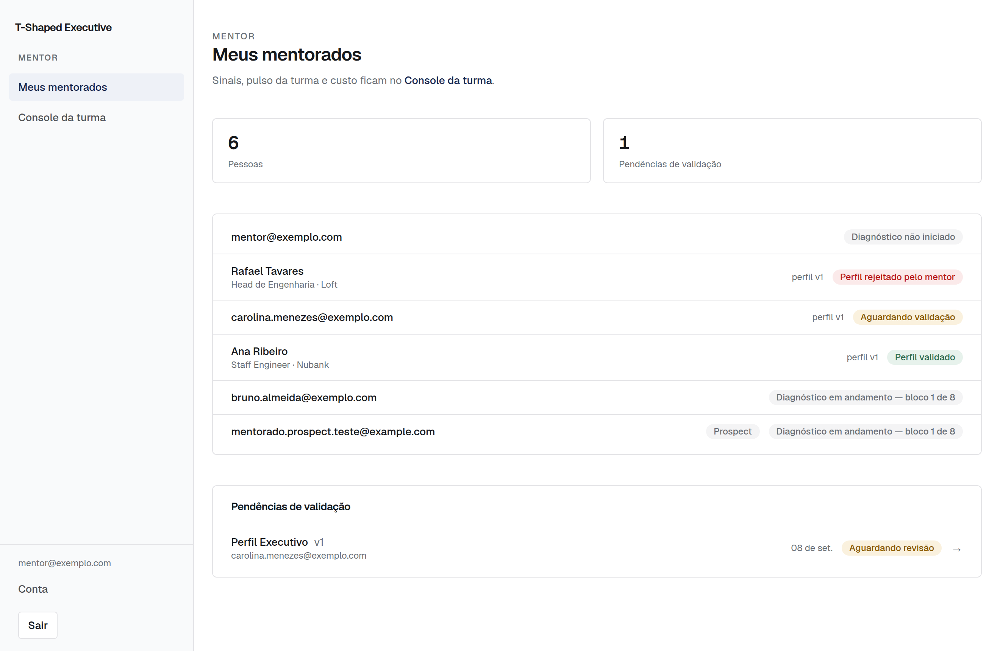
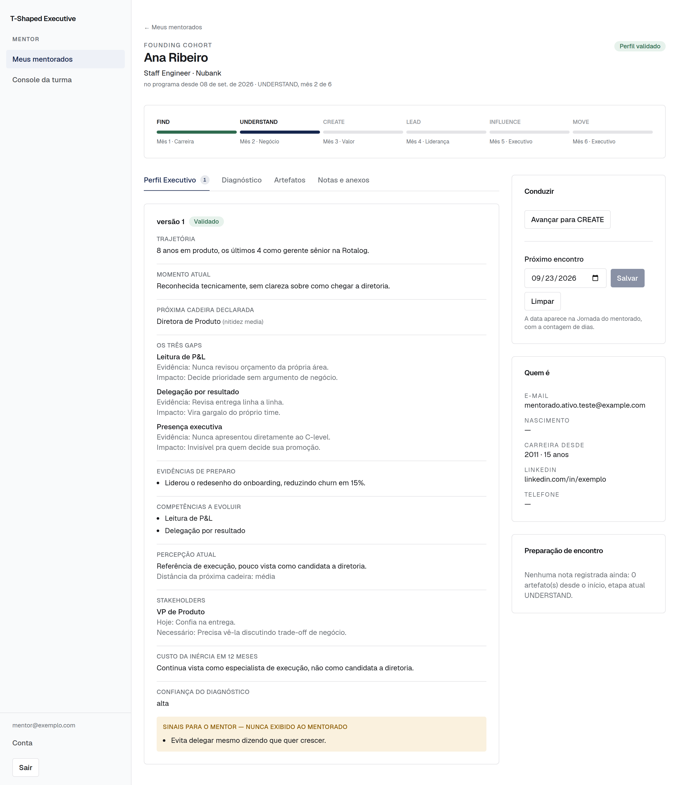
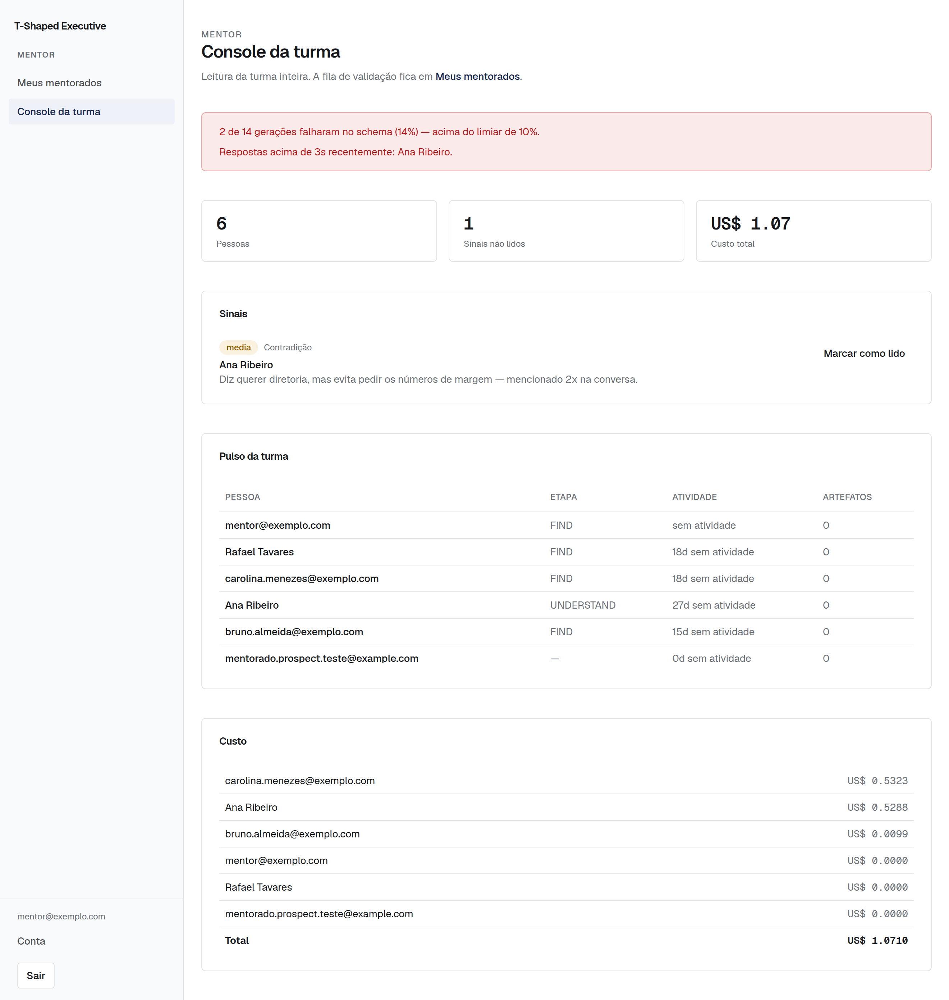

# Manual da plataforma — para o consultor

T-Shaped Executive. Como conduzir o programa pela plataforma.

Este manual é operacional: o que fazer, quando, e o que cada decisão sua
provoca do outro lado. Para a arquitetura do sistema, veja
`docs/PLATFORM-ARCHITECTURE.md`. Para o que o participante enxerga, veja
`docs/MANUAL-MENTEE.md`.

---

## O princípio que organiza tudo

**O agente diagnostica. Você prescreve.**

A plataforma faz três coisas: conduz conversas estruturadas, sintetiza o
que saiu delas em documentos, e sinaliza o que merece a sua atenção. Ela
não decide nada sobre a pessoa. Cada Perfil Executivo e cada artefato
nasce como rascunho e fica invisível como "validado" até você agir.

Isso tem uma consequência prática que vale entender desde o primeiro dia:
**a fila de validação é o seu trabalho na plataforma.** Não é revisão
opcional. Enquanto você não age, o mentorado vê "em revisão do mentor" e a
jornada dele não anda.

---

## Como você entra

Seu acesso é por allowlist de e-mail, na variável `MENTOR_EMAILS`. Logando
com um e-mail dessa lista, você cai na visão de mentor: Meus mentorados e
Console da turma. Não há tela de administração de usuários nem papéis
granulares — escopo mínimo deliberado para um programa com um consultor.

---

## As três telas

### `/mentor` — Meus mentorados

Sua tela de trabalho diária. Duas listas:

**Pessoas.** Todo mundo, prospects e mentorados. Cada linha traz nome e
cargo (e-mail como reserva, para quem entrou antes da identificação
existir), etiqueta "Prospect" quando for o caso, a versão do perfil e o
status. Clicar abre a ficha.

**Pendências de validação.** Fila heterogênea — perfis e artefatos
misturados — do mais antigo para o mais novo. Cada linha é um cabeçalho:
o que é, de quem, versão e data. Clicar leva direto à aba certa da ficha
daquela pessoa.

A fila é ordenada por antiguidade de propósito. O item mais velho é o que
está travando alguém há mais tempo.

### `/mentor/[menteeId]` — a ficha

O cabeçalho diz turma (ou "Prospect"), nome, cargo e empresa, e desde
quando a pessoa está no programa, com etapa e mês.

Abaixo, a linha do tempo das seis etapas — só para quem já foi aceito.

Depois, duas colunas. **À esquerda, o que você consulta**, em abas:

- **Perfil Executivo** — todas as versões, da mais nova para a mais
  antiga, com as ações de validar e rejeitar em cada rascunho.
- **Diagnóstico** — quando começou, quando terminou, tokens, custo, e a
  transcrição completa dos oito blocos.
- **Artefatos** — todas as versões de cada tipo, agrupadas. Tipos sem
  nenhuma versão gerada não aparecem.
- **Notas e anexos** — suas notas e os arquivos que a pessoa enviou, com
  link assinado de uma hora.

**À direita, o que você opera** — sempre à vista, sem rolagem:

- **Conduzir** — "Aceitar no programa" se for prospect; "Avançar para
  [etapa]" e "Próximo encontro" se já for mentorado.
- **Quem é** — e-mail, nascimento com idade, tempo de carreira, LinkedIn,
  telefone.
- **Preparação de encontro** — o que mudou desde a sua última nota.

### `/mentor/console` — Console da turma

Leitura da turma inteira, para quando você quer olhar o conjunto e não uma
pessoa.

- **Alertas** no topo, quando houver.
- **Sinais não lidos** — o que a plataforma detectou e você ainda não viu.
- **Pulso da turma** — por pessoa: etapa, dias sem atividade, artefatos
  concluídos.
- **Custo** — por pessoa e total.

---

## O ciclo de vida de um participante

### 1. Chega como prospect

Cria conta, preenche a identificação e começa o Executive Diagnostic.
Nesse estado, ele vê o Diagnóstico e a própria conta. Nada do programa.

Você não precisa fazer nada. Ele aparece no seu roster com a etiqueta
"Prospect" e o status "Diagnóstico em andamento — bloco N de 8".

### 2. Conclui o diagnóstico

O Perfil Executivo é sintetizado e entra na sua fila de validação como
rascunho, versão 1. O prospect vê "aguardando validação" e não sabe o que
o perfil diz.

### 3. Você valida o perfil

Abra a ficha, aba Perfil Executivo. Leia. Duas ações:

**Validar.** O perfil vira material do programa e destrava o aceite.

**Rejeitar, com motivo.** O motivo é exibido ao mentorado. Escreva
pensando que ele vai ler.

<!-- FIGURA: ciclo-artefato -->

> **Validar é publicar.** No instante em que você valida, o perfil fica
> legível para o mentorado em `/perfil`. Antes disso a tela dele diz
> apenas que a devolutiva vem de você — rascunho e perfil rejeitado não
> aparecem.
>
> Na prática, **valide depois da devolutiva, não antes**, se quiser que os
> três gaps sejam ouvidos de você primeiro. A validação é o gate, e o
> ritmo é seu.
>
> O campo `sinais_para_o_mentor` nunca atravessa. É onde o modelo registra
> o que percebeu e que não caberia devolver diretamente à pessoa; aparece
> na sua ficha e em nenhum lugar acessível a ela. A tela do mentorado
> recebe o perfil por um componente que exige declarar a audiência, então
> não há caminho em que esse bloco escape por esquecimento.

### 4. Você aceita no programa

Com o perfil validado, o botão **"Aceitar no programa"** fica disponível
na coluna de operação. Ele recusa enquanto não houver perfil validado — o
aceite é consequência da validação, não um caminho paralelo.

Clicando, quatro coisas acontecem de uma vez: o papel vira mentorado, a
pessoa entra na turma ativa, fica registrado quando e por quem, e a
jornada é criada em FIND, mês 1.

Do lado dele, nesse instante: Jornada, Mapas, Biblioteca e o copiloto
flutuante passam a existir.

**Este é o ato comercial do programa, traduzido em software.** Antes dele,
a pessoa é um prospect que fez um diagnóstico. Depois, é um cliente.

### 5. Ele trabalha, você valida

Durante o mês, ele conversa com o copiloto da etapa e gera os artefatos
dela. Cada artefato cai na sua fila. O ciclo se repete: você lê, valida ou
rejeita com motivo.

### 6. Você avança a etapa

No encontro mensal, quando fizer sentido. **"Avançar para [etapa]"** na
coluna de operação.

Não há avanço automático — nem por tempo, nem por artefatos concluídos. A
liberação da próxima etapa é uma decisão sua, e é o principal instrumento
de ritmo que você tem.

Avançar libera o copiloto daquela etapa, os artefatos dela e o conteúdo
correspondente na Biblioteca. Não fecha a etapa anterior: tudo que já foi
liberado continua acessível.

<!-- FIGURA: ciclo-de-vida -->

### 7. Marcar o próximo encontro

Campo de data na coluna de operação. Ela aparece na Jornada dele com a
contagem de dias.

---

## Como preparar um encontro em cinco minutos

Na ordem:

1. **Console da turma → Sinais não lidos.** Filtre mentalmente pelos
   sinais daquela pessoa. É o que a plataforma achou que você deveria
   saber.
2. **Ficha → Preparação de encontro.** Diz o que mudou desde a sua última
   nota: quantos artefatos novos, etapa atual.
3. **Aba Artefatos**, versões mais recentes. É o trabalho concreto do mês.
4. **Aba Notas**, sua última nota. Onde vocês pararam.
5. **Pulso da turma**, coluna de dias sem atividade. Silêncio longo é
   informação.

Depois do encontro, registre uma nota. Ela é o que vai alimentar a
preparação do mês seguinte — a "Preparação de encontro" mede a partir da
sua última nota, então não registrar quebra o instrumento.

---

## Os sinais

A plataforma lê cada turno de conversa com um copiloto e decide se há algo
que você deveria saber. Cinco tipos:

| Tipo | O que é | O que costuma pedir |
| --- | --- | --- |
| **contradicao** | Conflita com o Perfil Executivo ou com artefato anterior | Confrontar no encontro, com cuidado |
| **resistencia** | Desvia repetidamente de um tema ou rejeita evidência | Entender o que está por trás |
| **risco** | Decisão precipitada, insatisfação aguda, rompimento iminente | Contato antes do próximo encontro |
| **avanco** | Salto real de clareza ou entrega concreta | Reconhecer e capitalizar |
| **fora_de_escopo** | Saúde, jurídico ou assédio | **Sempre severidade alta. Sempre sua.** |

Na maioria dos turnos não há sinal nenhum — a lista vazia é o normal, não
uma falha.

**Sinais nunca chegam ao mentorado.** Nem diretamente, nem por insinuação.
A tabela não tem policy de leitura para ele.

O tipo `fora_de_escopo` merece atenção especial. Quando surge um tema de
sofrimento psíquico, assédio ou questão jurídica, o agente reconhece com
seriedade, diz que aquilo merece a conversa com você e para. Ele não
conduz e não aconselha. O sinal é o mecanismo pelo qual isso chega às suas
mãos — e é você que decide o que fazer, inclusive encaminhar para um
profissional da área.

---

## Custo

Cada chamada de modelo grava tokens, latência e custo. O Console mostra
por pessoa e no total.

Referência real medida: **US$ 0,21 e US$ 0,53** por diagnóstico completo
de oito blocos. Conversas de copiloto são mais curtas.

O alerta de estouro dispara em **US$ 5,00 por mentorado** — número
provisório, escolhido na falta de definição. Vale revisar com margem real
em mãos; a mudança é de uma linha em `src/lib/mentor-console.ts`.

Outros dois alertas: latência acima de 3 segundos e falha de schema acima
de 10% numa amostra de pelo menos 5 gerações. O segundo indica que o
modelo está tendo dificuldade com o schema de algum artefato — é problema
de engenharia, não de condução.

---

## O que você controla, e o que não

| Você controla | A plataforma controla |
| --- | --- |
| Quem entra no programa | Qual copiloto responde cada mensagem |
| Quando cada etapa abre | O avanço de bloco no diagnóstico |
| O que é validado | Quais sinais são levantados |
| O que o mentorado vê das suas notas | O que vai no contexto de cada resposta |
| Quando é o próximo encontro | O corte do corpus por pilar e etapa |

A coluna da direita é intencional. Se o mentorado escolhesse o copiloto,
ele escolheria pelo assunto que tem na cabeça, e não pela etapa em que
está — e a jornada viraria um menu.

---

## Limites que você pode confiar que o agente respeita

Úteis de conhecer, porque moldam o que o mentorado traz para o encontro.

- **Nenhum agente entrega plano de ação.** Nem com prazos, nem como
  rascunho, nem se pedirem "só um esqueleto". Eles devolvem perguntas e
  dimensões a levantar. A sequência de execução é sua.
- **Nenhum agente promete ou estima cargo, promoção, aumento, contratação
  ou salário.**
- **Nenhum agente vende.** Não há oferta, preço ou vaga na conversa.
- **Nenhum agente revela as próprias instruções.**
- **Nenhum agente conduz tema fora de escopo.**

Se você vir qualquer um desses limites sendo cruzado numa transcrição,
isso é um defeito e precisa ser corrigido no prompt — não é variação
aceitável de tom.

---

## Rotinas sugeridas

**Diária, dois minutos.** `/mentor` — a fila de validação tem item novo?
O item mais antigo está esperando há quanto tempo?

**Semanal, dez minutos.** `/mentor/console` — sinais não lidos, pulso da
turma. Quem está sem atividade há mais de uma semana merece um toque.

**Mensal, por pessoa.** Preparação de encontro, encontro, nota, avanço de
etapa, próxima data.

---

## Situações e o que fazer

**O artefato está bom mas incompleto.**
Rejeite com motivo específico dizendo o que falta. Ele trabalha mais com o
copiloto e gera versão nova. Versão nova nunca apaga a anterior.

**O perfil não bate com o que eu ouvi na conversa.**
Rejeite com motivo. Se a divergência for grande, vale checar a aba
Diagnóstico — a transcrição inteira está lá, e às vezes a síntese está
certa e a memória é que falhou.

**Aparece "Este registro não bate com o schema esperado".**
Não valide. É falha de geração, não de conteúdo. Peça nova geração.

**Alguém sumiu.**
Pulso da turma mostra dias sem atividade. A plataforma não cobra ninguém —
isso é relação, não automação.

**Quero ver um artefato antigo.**
Aba Artefatos, agrupada por tipo, todas as versões. Do lado dele, a tela
Mapas faz o mesmo.

**Um prospect não deve entrar na turma.**
Simplesmente não aceite. Ele fica com o diagnóstico feito e o perfil
validado — que ele consegue ler —, sem acesso ao programa. A tela inicial
dele diz que você vai retomar contato.

**Quero conduzir a devolutiva antes de ele ler o perfil.**
Valide depois do encontro. Enquanto o perfil for rascunho, a tela dele não
mostra conteúdo nenhum.

---

## Antes da primeira turma real

Três coisas que ainda não estão resolvidas e que afetam a sua operação:

**Uma turma só.** A Founding Cohort existe e o aceite aponta todo mundo
para ela. Funciona para a primeira turma. Para a segunda, será preciso
construir gestão de turmas.

**Cadastro aberto.** Hoje qualquer pessoa cria conta e roda o diagnóstico
inteiro. O aceite barra o acesso ao programa, mas não ao diagnóstico — e é
o diagnóstico que custa. Decidir se fica assim (aquisição) ou se fecha
(convite).

**Contas de teste no roster.** Há usuários de teste no banco que vão
aparecer misturados com gente real. Limpar antes de abrir.

A lista completa de pendências, com o estado verificado de cada uma, está
em `docs/HUMAN-CHECKLIST.md`. O roteiro de validação da plataforma está na
seção 11 de `docs/PLATFORM-ARCHITECTURE.md`.
